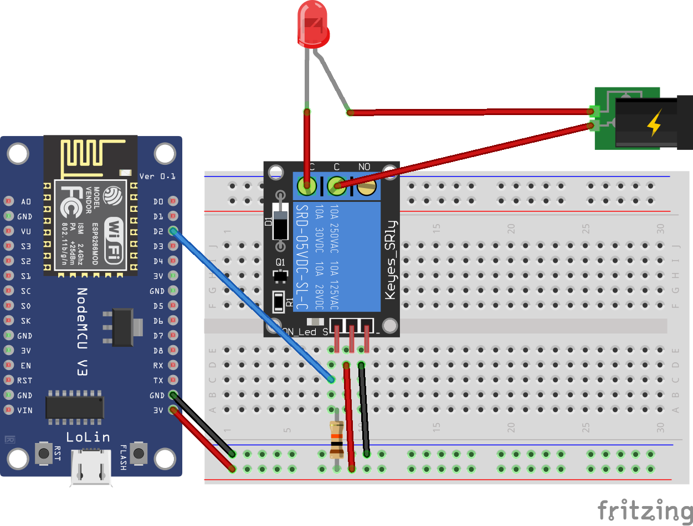

# IOT Server Relay with esp8266 and web server

## Components
* NodeMCU
* Relay
* Breadboard

## Architecture


## Configuration
### Application variables
| Variable | Default value | Description |
| ------ | ------ | ------ |
| DHT_PIN | D2 | Digital pin where is connected the relay |
| WIFI_SSID | "" | Wifi ssid |
| WIFI_PASSWORD | "" | Wifi password |

### Build variables
```bash
# Unix 
export WIFI_SSID="your ssid here"
export WIFI_PASSWORD="your password here"

# Windows
set WIFI_SSID="your ssid here"
set WIFI_PASSWORD="your password here"
```
